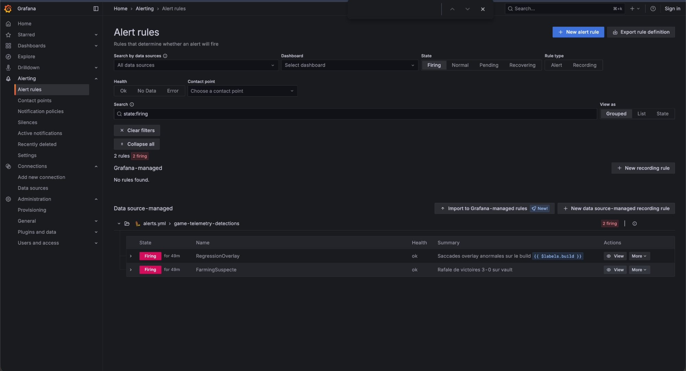
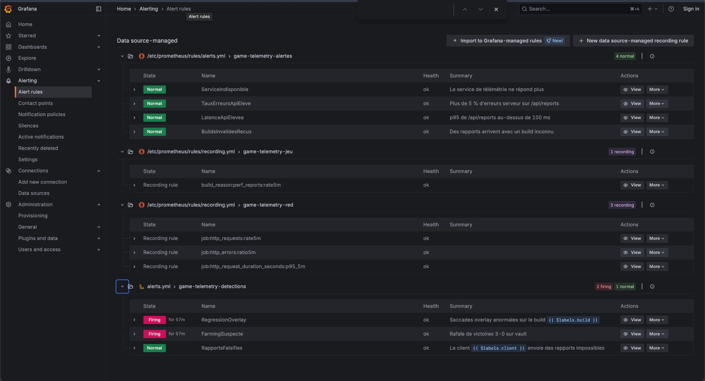

# Enquête sur l'export du 19 au 27 septembre 2026

## 1. Typologie des rapports de performance (2 110 rapports après dédoublonnage)

| Famille                | Signature                                                                  | Nombre | Filtre LogQL                                             |
| ---------------------- | -------------------------------------------------------------------------- | ------ | -------------------------------------------------------- |
| Rendu générique        | `renderWorld` dominant, phase `play`                                       | 1 069  | (le reste)                                               |
| Compilation de shaders | phase `warmup`, nombreux `newPrograms`                                     | 459    | `| json phase="report.phase" | phase="warmup"`           |
| Overlay                | `renderOverlay` > 100 ms                                                   | 262    | `| json o="report.work.details.renderOverlay" | o > 100` |
| Onglet caché           | activité `visibilityHidden`, `frameMs` ≈ 3,6 s mais `work.totalMs` ≈ 35 ms | 158    | `|= "visibilityHidden"`                                  |
| Réseau                 | `reason = network`, `rttMs` > 300 ms                                       | 92     | `| json reason="report.reason" | reason="network"`       |
| Falsifié               | étape `render` négative, fps impossibles                                   | 70     | `| json fps="report.fps" | fps > 240`                    |

## 2. Saccades depuis jeudi soir

- **Version en cause** : `beta-20260924-3`, déployée progressivement à partir du jeudi 24 septembre.
- **Signature** : le rendu de l'overlay (`renderOverlay`) passe à 300-600 ms, contre quelques ms normalement.
- **Preuve** : 190 rapports overlay sur `beta-20260924-3` et 59 sur `beta-20260926-5`, contre 9 au total sur les deux versions précédentes (captures `enquete-1` et `enquete-2`).
- **Population touchée** : écrans de 2560 px de large ou plus avec le bloom activé, soit 249 rapports sur 262 (95 %), tous navigateurs (capture `enquete-3`).
- **Correction** : non, la version `beta-20260926-5` présente toujours le problème.

## 3. Abus

### Farming de victoires

- 86 parties durent moins de 3 minutes, alors qu'une partie normale dure de 3 à 14 minutes.
- 83 d'entre elles sont sur la carte **vault**, gagnées **3-0**, regroupées sur deux nuits (nuit du 22 au 23 et nuit du 24 au 25, vers 1-2 h).
- L'anti-triche n'en a mis que **17 en quarantaine sur 83 (20 %)**.
- Preuves : captures `enquete-4` et `enquete-5`.

### Client qui falsifie ses rapports

- Un seul client, `5e1f0c7a`, envoie 70 rapports aux valeurs impossibles : étape de rendu négative (jusqu'à -101 ms), fps de 240 à 1 200 alors que `frameMs` correspond à environ 20 fps, `work.totalMs` supérieur à la durée de l'image.
- Profil constant : Safari sur Mac, 1366×633, version `beta-20260924-3`, du 24/09 au 26/09.
- Ces rapports doivent être exclus des analyses de performance.
- Preuves : captures `enquete-6` et `enquete-7`.

## 4. Phénomènes récurrents

- **Compilation de shaders** : 459 rapports, à chaque début de partie (phase `warmup`). C'est un coût connu, à réduire avec un préchauffage des shaders, pas une régression.
- **Rafales de parties suspectes la nuit** : deux épisodes de farming, aux mêmes heures, à deux jours d'intervalle.

## 5. Faux positifs à écarter

- **Onglets cachés** (158 rapports) : le navigateur met le jeu en pause quand l'onglet n'est pas visible. `frameMs` est énorme, mais le jeu n'a presque pas travaillé. Ce ne sont pas de vraies saccades.
- **Les 3 parties courtes sur foundry** : isolées et sans répétition, elles ne suffisent pas à conclure à de la triche.  

## Preuves

Sur le flux live (simulation et loadgen), deux détections sont en firing :

- **RegressionOverlay** : le loadgen envoie environ 20 % de rapports overlay sur le build `beta-20260926-6`, au-dessus du seuil de 10 %.
- **FarmingSuspecte** : la simulation produit des rafales de parties terminées en 3-0 sur vault, comme pendant les nuits du 22 au 23 et du 24 au 25 septembre dans l'export.

RapportsFalsifies reste en normal : aucun client live n'envoie de rapport avec fps > 240 ou un temps de rendu négatif.

